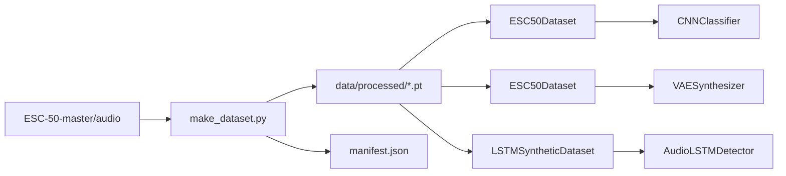

# Nature Sound Generator — Design Specification

**Date:** 2026-05-19  
**Status:** Approved (brainstorming)  
**Source:** `SPEC.md` + design session decisions

## 1. Overview

Laboratory project for environmental sound analysis on **ESC-50** (2000 clips, 5 s, 50 classes). Three tasks:

1. **CNN** — 50-class clip classification (mel spectrogram 128×128)
2. **LSTM** — frame-level binary detection of a target class in synthetic 30 s tracks
3. **VAE** — mel spectrogram generation / reconstruction

Architecture follows **CCDS Lite**: logic in `src/*.py`, Jupyter notebooks for experiments only, strict data separation.

## 2. Decisions Log

| Topic | Decision |
|-------|----------|
| Project root layout | `data/`, `src/`, `notebooks/` at repo root (`nature-sound-generator/`) |
| Raw data location | Existing `ESC-50-master/` (audio + `meta/esc50.csv`) |
| Data pipeline | **Approach 3 (hybrid):** preprocess 5 s clips to `.pt`; LSTM synthetics at runtime |
| LSTM task | Target class **14** (chirping birds); 30 s waveform stitch; per-frame 0/1 labels |
| LSTM model | Seq2seq: `[B, T, 1]` logits per time frame |
| Train/val/test | ESC-50 **official folds** (default test fold 5; val from train folds) |
| Device | `cuda` if available, else `cpu` |
| Language | English (code, comments, README, notebooks) |
| Package manager | **uv** (`pyproject.toml` + `uv.lock`; `uv sync` / `uv run`) |
| Implementation | Stages 1→5 per `SPEC.md`; stop after each stage until user approves |
| Version control | **No audio in git:** entire `ESC-50-master/`, `data/raw/`, `data/processed/`, and `*.wav` etc.; README has download link + layout |

## 3. Repository Layout

```text
nature-sound-generator/
├── ESC-50-master/              # NOT in git — user downloads (see README)
│   ├── audio/*.wav
│   └── meta/esc50.csv
├── data/
│   ├── raw/                    # Optional local raw copies (gitignored)
│   └── processed/              # Generated .pt + manifest (gitignored)
├── src/
│   ├── __init__.py
│   ├── config.py               # Paths, hyperparameters, constants
│   ├── data/
│   │   ├── make_dataset.py
│   │   └── dataloaders.py
│   ├── models/
│   │   ├── cnn.py
│   │   ├── lstm.py
│   │   ├── vae.py
│   │   └── trainer.py
│   └── visualization/
│       └── visualize.py
├── notebooks/
│   ├── 01-data-exploration.ipynb
│   ├── 02-cnn-classification.ipynb
│   ├── 03-lstm-detection.ipynb
│   └── 04-vae-synthesis.ipynb
├── tests/                      # Optional smoke tests
├── docs/superpowers/specs/     # This document
├── pyproject.toml
├── uv.lock
└── README.md
```

## 4. Dependency Management (uv)

- **`pyproject.toml`** — project metadata and runtime dependencies
- **`uv.lock`** — locked versions (committed)
- **Commands:**
  - `uv sync` — install environment
  - `uv run python -m src.data.make_dataset` — preprocess
  - `uv run jupyter lab` — notebooks
  - `uv run pytest` — smoke tests (if enabled)

**Runtime dependencies:** `torch`, `torchaudio`, `numpy`, `scikit-learn`, `matplotlib`, `seaborn`, `jupyter`, `librosa` (fallback/reserve per SPEC).

**Dev dependencies:** `pytest` (optional smoke tests).

## 5. Configuration (`src/config.py`)

| Constant | Value |
|----------|--------|
| `PROJECT_ROOT` | Parent of `src/` (via `pyproject.toml` marker) |
| `RAW_AUDIO_DIR` | `ESC-50-master/audio` |
| `META_CSV` | `ESC-50-master/meta/esc50.csv` |
| `PROCESSED_DIR` | `data/processed` |
| `TARGET_CLASS` | `14` (chirping birds; overridable) |
| `LSTM_DURATION_S` | `30` |
| `TEST_FOLD` | `5` |
| `VAL_FOLD` | `4` (one fold held out from train folds) |
| `NUM_CLASSES` | `50` |
| `MEL_SIZE` | `128×128` (CNN/VAE per clip) |
| `SAMPLE_RATE` | `44100` |
| `RANDOM_SEED` | `42` |

## 6. Data Pipeline

### 6.1 Flow



### 6.2 `make_dataset.py`

- Read each row in `esc50.csv`; load matching wav from `ESC-50-master/audio/`
- Transform: `torchaudio` load → `MelSpectrogram` → normalize → resize to **128×128**
- Save `data/processed/{stem}.pt` tensor
- Write `manifest.json`: `{filename, target, fold, category, path}`
- **Idempotent:** skip if output exists and source mtime unchanged
- **CLI:** `uv run python -m src.data.make_dataset`
- **Failure:** error if fewer than 90% of CSV rows successfully processed; log and skip corrupt files

### 6.3 `dataloaders.py`

#### `ESC50Dataset`

- Returns `(spectrogram [1,128,128], label int 0-49)` from processed `.pt` + manifest

#### `get_dataloaders(task, batch_size, test_fold=5)`

- `task ∈ {"cnn", "vae", "lstm"}`
- **Split:** train = all folds ≠ `test_fold`; test = `test_fold`; val = `VAL_FOLD` from remaining train folds
- CNN/VAE: standard `DataLoader` over `ESC50Dataset`

#### `LSTMSyntheticDataset` (runtime synthesis)

1. Sample clips from processed cache (or load wav segments) by fold split
2. **Waveform stitch** into 30 s: alternating regions of:
   - Target class (14) → label **1**
   - Silence (zeros) → label **0**
   - Other classes → label **0**
3. Target regions ~40% of timeline; silence vs other background 50/50 when not target; min target segment 0.5 s
4. Single `MelSpectrogram` on full 30 s waveform → time-major `mel [T, 128]`
5. Build `labels [T]` by mapping sample-level regions to mel frames (same `hop_length` / `n_fft` as transform)
6. Return `(mel [T, 128], labels [T])` — collate to `[B, T, 128]`, `[B, T]`

## 7. Models

### 7.1 `CNNClassifier` (`src/models/cnn.py`)

- `Conv2d` → `BatchNorm2d` → `ReLU` → `MaxPool2d` (stacked) → flatten → FC
- Output: **50 logits** (no softmax in forward; `CrossEntropyLoss` in trainer)

### 7.2 `AudioLSTMDetector` (`src/models/lstm.py`)

- Input: `[B, T, 128]` (batch_first)
- `nn.LSTM` → per-timestep `nn.Linear` → **`[B, T, 1]`** logits
- **Not** one scalar per file — sequence-to-sequence binary classification
- Loss: `BCEWithLogitsLoss` over all frames

### 7.3 `VAESynthesizer` (`src/models/vae.py`)

- Encoder → `mu`, `logvar`; `reparameterize(z)`; Decoder with `ConvTranspose2d`
- Reconstruction target: **128×128** mel (same preprocessing as CNN)
- Loss: reconstruction (MSE on spectrogram) + KL divergence

### 7.4 `ModelTrainer` (`src/models/trainer.py`)

| Method | Loss | Metrics |
|--------|------|---------|
| `train_classifier` | `CrossEntropyLoss` | loss, accuracy |
| `train_lstm_detector` | `BCEWithLogitsLoss` | loss, frame accuracy |
| `train_vae` | recon + KL | loss, recon, KL |

- Log metrics each epoch to stdout
- Device from config (auto CUDA/CPU)

## 8. Visualization (`src/visualization/visualize.py`)

- Griffin-Lim mel → audio (`torchaudio`)
- Training curves (loss vs epoch)
- `ConfusionMatrixDisplay` (CNN)
- ROC curve (LSTM; frame-level scores)
- Side-by-side spectrograms (VAE input vs reconstruction)

## 9. Notebooks

| Notebook | Purpose |
|----------|---------|
| `01-data-exploration.ipynb` | EDA, manifest stats, sample spectrograms |
| `02-cnn-classification.ipynb` | Train/eval CNN, confusion matrix |
| `03-lstm-detection.ipynb` | Train LSTM, ROC, example timeline plot |
| `04-vae-synthesis.ipynb` | Train VAE, compare spectrograms, optional audio |

Notebooks import from `src` only; no business logic duplicated.

## 10. Training Defaults

| Parameter | CNN/VAE | LSTM |
|-----------|---------|------|
| `batch_size` | 32 | 8 |
| `epochs` | 20 | 30 |
| `learning_rate` | 1e-3 (Adam) | 1e-3 (Adam) |
| `num_workers` | 0 (Windows), 2 (else) | same |

## 11. Error Handling

- Missing `ESC-50-master/audio/`: fail fast with README instructions
- Invalid `test_fold`: assert fold in 1..5
- Corrupt wav: warning + skip; abort batch if success rate < 90%
- All paths via `pathlib.Path`

## 12. Version Control & README

### 12.1 `.gitignore` (root)

Heavy and derived data must never be committed:

| Pattern | Reason |
|---------|--------|
| `ESC-50-master/` | Full ESC-50 tree (~600 MB+ with audio) |
| `data/raw/` | Any local raw audio copies |
| `data/processed/` | Generated mel tensors |
| `*.wav`, `*.flac`, `*.mp3`, … | Audio anywhere in the repo |
| `.venv/`, `__pycache__/`, `.ipynb_checkpoints/` | Tooling artifacts |

### 12.2 README dataset section

The README documents:

- Link to official ESC-50: https://github.com/karolpiczak/ESC-50
- Exact target path: `ESC-50-master/audio/` + `ESC-50-master/meta/esc50.csv`
- Command to build processed data after `uv sync`

No auto-download in code; missing `ESC-50-master/audio/` fails with a pointer to README.

## 13. Smoke Tests (optional)

- `test_make_dataset.py` — one file → output shape 128×128
- `test_lstm_dataset.py` — labels length matches mel time dim; values in {0,1}
- `test_models.py` — forward shapes CNN `[B,50]`, LSTM `[B,T,1]`, VAE `[B,1,128,128]`

## 14. Implementation Phases

| Phase | Deliverable | Gate |
|-------|-------------|------|
| 1 | `config.py`, `make_dataset.py`, `dataloaders.py`, `pyproject.toml`, `.gitignore`, README (dataset link + paths) | User approval |
| 2 | `cnn.py`, `lstm.py`, `vae.py` | User approval |
| 3 | `trainer.py` | User approval |
| 4 | `visualize.py` | User approval |
| 5 | Four notebooks | User approval |

## 15. Out of Scope (YAGNI)

- Hyperparameter search / experiment tracking (MLflow, W&B)
- Production API or web UI
- Auto-download of ESC-50 (user provides `ESC-50-master/`)
- Multi-target LSTM or multi-class frame labels
- Distributed training
